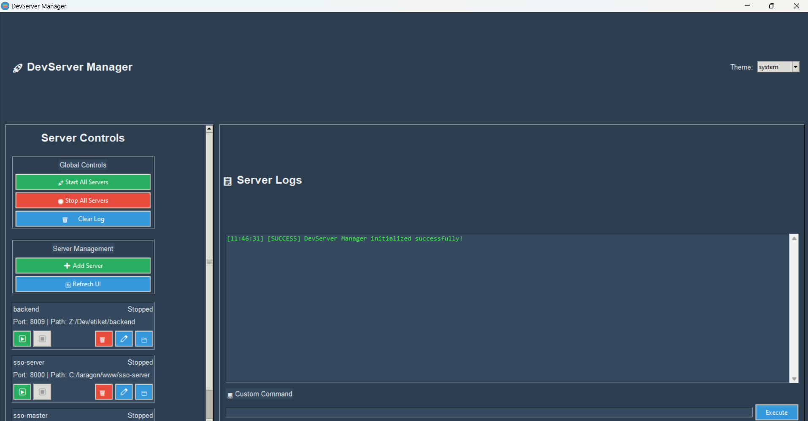

# 🚀 DevServer Manager

Aplikasi GUI modern untuk mengelola multiple development servers dengan arsitektur yang bersih dan fitur yang robust. Menggantikan batch script tradisional dengan interface yang intuitif dan fitur canggih.

[](https://www.virustotal.com/gui/file/a76f480d558e4a6cbf5a22c9d21bf8b95a2597f19ee5e4743c44cdb0b49d5b2c?nocache=1)
[](https://github.com/idpcks/DevServerManager)
[](https://www.virustotal.com/gui/file/a76f480d558e4a6cbf5a22c9d21bf8b95a2597f19ee5e4743c44cdb0b49d5b2c?nocache=1)



## ✨ Fitur Utama

- **🎯 Server Management**: Kelola multiple development servers dengan mudah
- **📋 Server Templates**: Template siap pakai untuk Laravel, Node.js, Python, Go, .NET, dll
- **🔍 Auto-Detection**: Deteksi otomatis jenis project berdasarkan file markers
- **🚦 Real-time Monitoring**: Monitoring status server secara real-time
- **💻 Custom Commands**: Eksekusi command custom dengan output real-time
- **🔔 System Tray**: Minimize ke system tray dengan quick access
- **🎨 Theme Customization**: Interface yang dapat dikustomisasi

## 🚀 Quick Start

### 1. Download & Install
```bash
# Download dari GitHub Releases
# Extract dan jalankan DevServerManager.exe
```

### 2. Setup Server
1. Klik "➕ Add Server"
2. Pilih template (Laravel, Node.js, Python, dll)
3. Pilih folder project
4. Aplikasi akan auto-detect konfigurasi

### 3. Manage Servers
- **Start**: Klik "▶️ Start" untuk server individual
- **Start All**: Klik "🚀 Start All Servers" untuk semua server
- **Stop**: Klik "⏹️ Stop" untuk menghentikan server

## 📋 System Requirements

- **OS**: Windows 10/11 (64-bit)
- **RAM**: Minimum 4GB
- **Storage**: 100MB free space
- **Network**: Internet connection (untuk server management)

## 📦 Download

### Untuk Pengguna
- **Download**: [GitHub Releases](https://github.com/idpcks/DevServerManager/releases)
- **Installation**: Extract dan jalankan `DevServerManager.exe`
- **No Setup**: Tidak perlu install Python atau dependencies

### Untuk Developer
```bash
git clone <repository-url>
cd runserver
pip install -r requirements.txt
python main.py
```

## 📚 Dokumentasi Lengkap

- **[User Guide](docs/USER_GUIDE.md)**: Panduan lengkap penggunaan aplikasi
- **[Configuration Guide](docs/CONFIGURATION.md)**: Panduan konfigurasi dan kustomisasi
- **[Troubleshooting](docs/TROUBLESHOOTING.md)**: Solusi masalah umum
- **[Developer Guide](docs/DEVELOPER.md)**: Panduan untuk developer

## 🔒 Security

- **✅ Virus Scan**: CLEAN - No threats detected (VirusTotal)
- **✅ Security Rating**: EXCELLENT
- **✅ Open Source**: Code dapat diaudit oleh komunitas
- **✅ Local Only**: Tidak ada data yang dikirim ke server eksternal

Lihat [Security Guide](docs/SECURITY.md) untuk detail lengkap.

## 🐛 Troubleshooting

### Masalah Umum
- **Server tidak start**: Cek path dan port conflict
- **GUI freeze**: Tunggu operasi selesai atau restart aplikasi
- **Permission error**: Jalankan sebagai administrator

Lihat [Troubleshooting Guide](docs/TROUBLESHOOTING.md) untuk solusi lengkap.

## 🤝 Contributing

Kontribusi sangat diterima! Lihat [Contributing Guide](CONTRIBUTING.md) untuk detail.

### Quick Start
1. Fork repository
2. Create feature branch: `git checkout -b feature/amazing-feature`
3. Follow [Code of Conduct](CODE_OF_CONDUCT.md)
4. Submit Pull Request

## 📄 License

MIT License - Lihat [LICENSE](LICENSE) untuk detail.

## 👨‍💻 Developer

**DevServer Manager** dikembangkan oleh **idpcks**

---

**📞 Support**: [GitHub Issues](https://github.com/idpcks/DevServerManager/issues) | **⭐ Star**: Jika membantu, berikan star di GitHub!